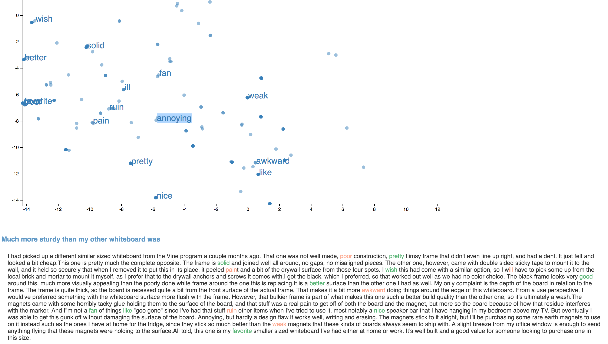

## Visualizing amazon product review

[project link](https://stels07.github.io/amazonProductReviews/index_compare.html)

This is a visulization that does product comparison based on the product reviews. [Amazon product dataset](http://jmcauley.ucsd.edu/data/amazon/) is used here. For each product on amazon, there is an average rating and a list of reviews, including a summary and review content, which provides potential customers information about the product besides the specs provided by the seller. Processing large amount of review content can take up a lot of user's time, and many of the reviews have repeated information which can also discourage user from keep reading. The goal of visualizing reviews is to allow user to abtain more information within a shorter period of time. 
However, text visualizaion is a difficult subject. This project is aimed at experimenting different visualizations for review data.   

After several attempts, a word2vec + tsne approach is adopted with a feature of product comparison in the final visualization. Pre-trained [word2vec model](https://github.com/3Top/word2vec-api) is used. [AFINN sentiment analysis](http://www2.imm.dtu.dk/pubdb/views/publication_details.php?id=6010) is used to add sentiment label to the words.  

#### products
Four products of boards were selected
[item1](https://www.amazon.com/Quartet-Magnetic-Inches-Assorted-Colors/dp/B00BH9GNYU) 
[item2](https://www.amazon.com/Quartet-Magnetic-Dry-Erase-Aluminum-ukte2436-W/dp/B00BH9GNVS)
[item3](https://www.amazon.com/Quartet-Bulletin-Board-Inches-MHOB1723-BK/dp/B00FW6S1NA)
[item4](https://www.amazon.com/Quartet-Magnetic-Dry-Erase-Inches-MHOW1114-GN/dp/B00FW6S3P6). Their review data were firstly pre-processed to a proper json format (select_1.json), and then processed (word2vec.py) for final data to plot. The process includes split review into words, convert words to vectors, attach sentiment to words, and create json output file (office_v1.json).  

#### selector

There are an item selector and two filters on the top. User can select the items they want to show on screen, and choose to filter out neutral words or show/hide all words.

#### scatterplot
The main plot is a scatter plot, with color of the circles mapped to the item of the product. To make more obvious words with sentiment, all neutral words are marked grey. Click on the circle will show the text, and click on the text will hide it.

Double click on the circle will show the full review that contains the word. Words with sentiment are highlighted with either red (negative word) or green (positive word), and at the same time words in the scatterplot regarding that review are highlighted as well.

#### brush
I found the combination use of brush and word vector map a very useful feature in terms of discovering certain aspect of the products. Word vector map makes similar words into clusters and then can be captured by the brush. Becuase the vectors are trained using the close context of the word, similar words, even with highly different sentiment label, can be mapped close together.

In the image below, we can see that the 1st item (blue) is superior than the 2nd item (purple) in terms of durability. 

A tooltip is attached to each showing word, which will appear on mouseover. A limited amount of review content (50 letters before and other currently) around that word is shown. I found this feature useful because user is intrigued by some words but loading them with full review will distract them from the original purpose. Nice and simple messages are more helpful. 

User can also locate where the "problem" cluster of words are, and further see what are the main complaints about multiple products, which takes advantage of the word vector map.

#### colors
Items of products are mapped to colors in the scatterplot. Also in the review text, green and red are mapped to positive and negative words. The sentiment of words have range -5 to 5 which is not mapped to anything currently. Color is already worked for items, I figure adding sentiment levels will make it more confusing.

It is possible that user is more likely to associate red related color to negative and green related color to positive senses. So the color mapped to items in the scatterplot would have an impact on user's judgement. The color schema can be further worked on.

### future work
 * It would be helpful to have a way of visualizing word frequency to avoid dense cluster of words, especially sentimented words.
* The sentiment analysis model is simple. If a product is describle as "not good", the "good" will be marked as a positive sentiment. It doesn't affect much becuase context are given as much as possible. But a more complicated sentiment model will definitely provide better result. Also, the sentiment 
*  There are miner bugs in the project. One being that we process the word in lower case, sometimes we couldn't find the lower cased word in the full review because the word was originally capitalized. Another bug is the word "I'll" will be processed as "ill", which would then be attached with a negative sentiment label. 

#### Inspired by and referenced:    
[Yelp review Tsne](https://gist.github.com/arnicas/dd2ef348ad8854e40ef2)

## Other efforts

Four other experimental sub-projects were also done during the term of this project. Detailed information can be found in the [processbook]()

One particular experimenting project is:
#### review visualization with sentence embedding and t-sne (experiment)

use
[sent2vec](https://github.com/ryankiros/skip-thoughts)
model to generate sentence vectors

test 1: data was grabbed manually from amazon product review on the book "being moral"

test 2: dataset from [amazon reviews](http://jmcauley.ucsd.edu/data/amazon/) 

##### analysis
on test 2, review sentences end with "?" or have quotes end up in clustered form. sentence embedding model does not interprete well long complicated sentences.

 

